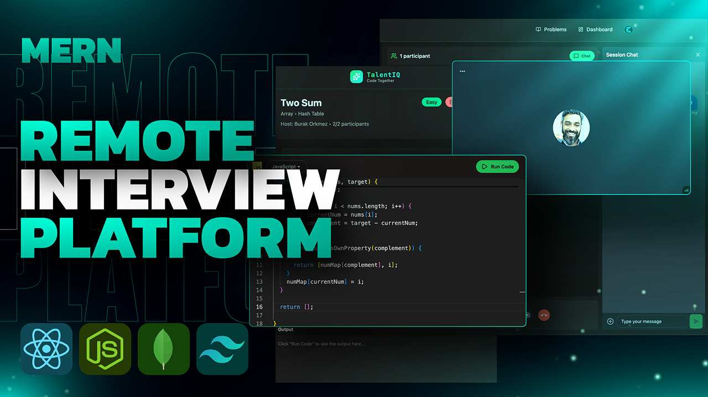

# TalentIQ — Interview Platform

A real-time collaborative coding interview platform where users can create sessions, solve coding problems together, and communicate via live video and chat.



---

## Features

- Authentication via Clerk (sign in / sign up)
- Create and join live coding sessions
- Collaborative code editor with Monaco (JavaScript, Python, Java)
- Real-time code execution via Piston API
- Live video calls powered by Stream Video SDK
- Real-time chat powered by Stream Chat SDK
- Problem library with examples, constraints, and starter code
- Confetti celebration on passing all test cases
- Dashboard with active and recent sessions
- Production-ready deployment on Render

---

## Tech Stack

### Frontend
| Tech | Purpose |
|------|---------|
| React 18 | UI framework |
| Vite | Build tool |
| TailwindCSS + DaisyUI | Styling |
| React Router | Client-side routing |
| Clerk | Authentication |
| TanStack Query | Server state management |
| Monaco Editor | Code editor |
| Stream Video React SDK | Video calls |
| Stream Chat React | Real-time chat |
| Canvas Confetti | Celebration effect |
| React Hot Toast | Notifications |
| Lucide React | Icons |

### Backend
| Tech | Purpose |
|------|---------|
| Node.js + Express | REST API |
| MongoDB + Mongoose | Database |
| Clerk Express | Auth middleware |
| Stream Node SDK | Video call management |
| Stream Chat | Chat channel management |
| Inngest | Background jobs |
| dotenv | Environment config |

---

## Project Structure

```
interview_platform/
├── backend/
│   └── src/
│       ├── controllers/     # Route handlers
│       ├── lib/             # DB, Stream, Inngest, env config
│       ├── middleware/      # Auth protection
│       ├── models/          # Mongoose schemas
│       ├── routes/          # Express routers
│       └── server.js        # Entry point
├── frontend/
│   └── src/
│       ├── api/             # Axios API calls
│       ├── components/      # Reusable UI components
│       ├── data/            # Problem definitions
│       ├── hooks/           # Custom React hooks
│       ├── lib/             # Axios, Piston, Stream clients
│       └── pages/           # Route pages
└── package.json             # Root scripts for deployment
```

---

## Getting Started

### Prerequisites
- Node.js >= 18
- MongoDB Atlas account
- Clerk account
- Stream account (for video + chat)

### 1. Clone the repo

```bash
git clone https://github.com/Ashish-Goyals/Interview_Resume.git
cd Interview_Resume/interview_platform
```

### 2. Backend setup

```bash
cd backend
npm install
```

Create `backend/src/.env`:

```env
PORT=5000
MONGO_URI=your_mongodb_uri
JWT_SECRET=your_secret
NODE_ENV=development
CLIENT_URL=http://localhost:3000
CLERK_PUBLISHABLE_KEY=your_clerk_publishable_key
CLERK_SECRET_KEY=your_clerk_secret_key
STREAM_API_KEY=your_stream_api_key
STREAM_API_SECRET=your_stream_api_secret
INNGEST_EVENT_KEY=your_inngest_event_key
INNGEST_SIGNING_KEY=your_inngest_signing_key
```

### 3. Frontend setup

```bash
cd frontend
npm install
```

Create `frontend/.env`:

```env
VITE_CLERK_PUBLISHABLE_KEY=your_clerk_publishable_key
VITE_STREAM_API_KEY=your_stream_api_key
```

### 4. Run locally

```bash
# Terminal 1 - Backend
cd backend && npm run dev

# Terminal 2 - Frontend
cd frontend && npm run dev
```

- Frontend: http://localhost:3000
- Backend: http://localhost:5000

---

## Deployment (Render)

### Root Directory
Set to `interview_platform` in Render dashboard.

### Build Command
```
npm install --prefix backend && npm install --prefix frontend && npm run build --prefix frontend
```

### Start Command
```
npm run start --prefix backend
```

### Environment Variables (Render)
```
NODE_ENV=production
PORT=5000
CLIENT_URL=https://your-render-url.onrender.com
MONGO_URI=...
CLERK_PUBLISHABLE_KEY=...
CLERK_SECRET_KEY=...
STREAM_API_KEY=...
STREAM_API_SECRET=...
INNGEST_EVENT_KEY=...
INNGEST_SIGNING_KEY=...
```

---

## API Routes

### Sessions
| Method | Route | Description |
|--------|-------|-------------|
| POST | `/api/sessions` | Create a session |
| GET | `/api/sessions/active` | Get active sessions |
| GET | `/api/sessions/my-recent` | Get recent sessions |
| GET | `/api/sessions/:id` | Get session by ID |
| POST | `/api/sessions/:id/join` | Join a session |
| POST | `/api/sessions/:id/end` | End a session |

### Chat
| Method | Route | Description |
|--------|-------|-------------|
| GET | `/api/chat/token` | Get Stream chat token |

---

## License

MIT
